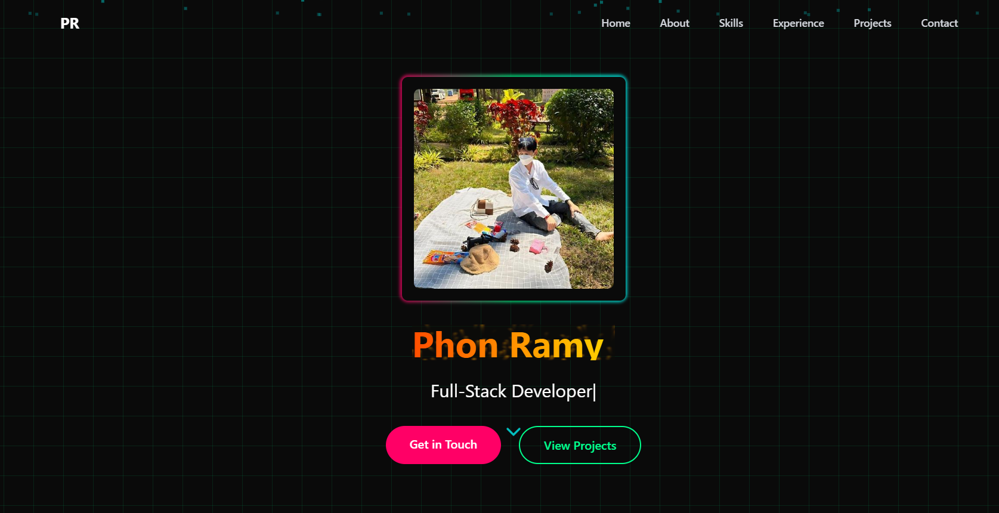

# Phon Ramy Portfolio

A modern, responsive portfolio website built with React, TypeScript, and Vite. The project showcases a developer’s work and technical skills with interactive components, smooth animations, and a dark/light theme toggle.


This modern portfolio website features a clean, responsive design with interactive components and smooth animations.


## Features

- **Responsive Design:** Tailwind CSS for responsive layouts and custom animations.
- **Interactive Components:** Animated sections using [Framer Motion](https://www.framer.com/motion/) with floating particles and dynamic grid backgrounds.
- **Theming:** Integrated dark/light modes using [next-themes](https://github.com/pacocoursey/next-themes) with a custom [ThemeToggle](src/components/ThemeToggle.tsx).
- **Projects Showcase:** A detailed projects section including a carousel for images and GitHub contributions display.
- **Skills & Experience:** Sections dedicated to technical skills and work experience with animated cards.
- **Contact Form:** A contact form for potential clients to get in touch.

## Project Structure

- **Root Files:**  
  - [package.json](package.json) – Project metadata and scripts  
  - [vite.config.ts](vite.config.ts) – Vite configuration  
  - [tailwind.config.js](tailwind.config.js) – Tailwind CSS configuration  
  - [postcss.config.js](postcss.config.js) – PostCSS setup  

- **Source Files:**  
  - [src/App.tsx](src/App.tsx) – Main application component  
  - [src/main.tsx](src/main.tsx) – Entry point for React rendering  
  - **Components:** Located in [src/components](src/components/) – Contains individual sections like [Hero](src/components/Hero.tsx), [About](src/components/About.tsx), [Skills](src/components/Skills.tsx), [Experience](src/components/Experience.tsx), [Projects](src/components/Projects.tsx), [Contact](src/components/Contact.tsx), [Navbar](src/components/Navbar.tsx), and [ThemeToggle](src/components/ThemeToggle.tsx)  
  - [src/ThemeProvider.tsx](src/ThemeProvider.tsx) – Provides theming support via next-themes

## Installation

1. Clone the repository:
   ```sh
   git clone https://github.com/Remy2404/portfolio.git
   ```

2. Navigate to the project directory:
   ```sh
   cd portfolio
   ```

3. Install dependencies:
   ```sh
   npm install
   ```

## Development

Run the development server with:
```sh
npm run dev
```
You can access the app in your browser at `http://localhost:3000` (or the port specified by Vite).

## Build & Deployment

To build the project for production:
```sh
npm run build
```
Preview the production build locally:
```sh
npm run preview
```

## Linting

Lint the codebase using:
```sh
npm run lint
```

## Technologies

- **React** – Front-end library for building UI components
- **TypeScript** – Strongly typed JavaScript for better code quality
- **Vite** – Fast and lean development tool
- **Tailwind CSS** – Utility-first CSS framework
- **Framer Motion** – Animation library for React
- **next-themes** – Theme switching for dark and light modes

## Contact

For any questions or suggestions, feel free to reach out via the Contact section of the website or send an email.

---

This project is maintained by Phon Ramy. Contributions and issues are welcome.


Feel free to modify or extend this template as needed!
Feel free to modify or extend this template as needed!